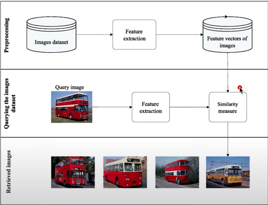

# Content-based-image-retrieval

## I. Idea

### 1. Available data

- Using CNN to make features extraction from our images data, we retrieve the images data as vectors

### 2. Query data

- Turning the query image into vectors with the same way as our available data

### 3. Calculating the distance between the query data with our available data

### 4. Show K number of data that nearliest match the query data

## II. Pipeline

